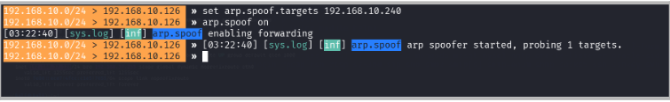
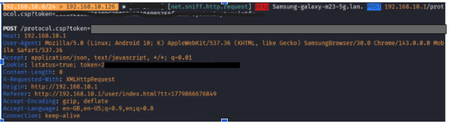

# MITM Attack Simulation Analysis

### 1. Objective
To demonstrate the security vulnerability of non-encrypted (HTTP) network traffic by performing a Man-in-the-Middle (MITM) attack and capturing data packets.

### 2. Environment & Tools
* **Attacker Machine:** Kali Linux (Bettercap v2.41.5)
* **Target Device:** Samsung Galaxy M23 5G
* **Technique:** ARP Spoofing

### 3. Methodology
* Identified the target IP and MAC address via network scanning.
* Executed ARP Spoofing to intercept the traffic between the target and the router.
* Enabled IP forwarding to allow traffic flow through the attacker machine.
* Used network sniffing to monitor and capture data packets in real-time.

### 4. Observations
The attack was successful. I intercepted HTTP traffic from the target device, which allowed me to capture sensitive information in clear-text, including:

* **Session Cookies**
* **Authentication Tokens**
* **User-Agent strings**

### 5. Risk Analysis
The captured data confirms that HTTP-based communication is highly insecure. An attacker can use these intercepted cookies and tokens to perform **Session Hijacking**, gaining unauthorized access to user accounts without needing passwords.

### 6. Recommendations
* **Use HTTPS:** Ensure all web communications use SSL/TLS encryption.
* **Use VPN:** Encrypt traffic on public or untrusted networks.
* **Network Security:** Implement Dynamic ARP Inspection (DAI) on routers to prevent ARP poisoning.
